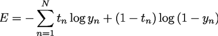

## ロジスティック回帰

### ロジスティック回帰の特徴

- 出力とは別に、その出力のクラスに所属する確率値が出せる
- 学習はオンライン学習でもバッチ学習でも可能
- 予測性能はまずまず、学習速度は早い
- 過学習を防ぐ為の`正則化`項が加わっている

特に出力の確率値が出せるという特徴のため、広告のクリック予測にもよく使われている。

### 実践系の参考記事

-[新シリーズ第8回「ロジスティック回帰分析でターゲットを確率的に予測する」](https://www.rad.co.jp/statistical/%E6%96%B0%E3%82%B7%E3%83%AA%E3%83%BC%E3%82%BA%E7%AC%AC8%E5%9B%9E%E3%80%8C%E3%83%AD%E3%82%B8%E3%82%B9%E3%83%86%E3%82%A3%E3%83%83%E3%82%AF%E5%9B%9E%E5%B8%B0%E5%88%86%E6%9E%90%E3%81%A7%E3%82%BF%E3%83%BC/)
- [ロジスティック回帰](https://qiita.com/yshi12/items/3dbd336bd9ff7a426ce9)
- [ロジスティック回帰を実装してみよう](https://dev.classmethod.jp/machine-learning/logistic-regression-impl/)

### ロジスティック回帰の決定境界

- 決定境界は直線

### ロジスティック回帰の仕組み

- `活性化関数`は`シグモイド関数`
- `損失関数`は`交差エントロピー誤差関数`

#### シグモイド関数

- 入力が0の時は0.5をとる
- 値が小さくなるほど0に近づく
- 値が大きくなる程に1に近づく


#### シグモイド関数を記述するコード

```
def sigmoid(x):
    return 1 / (1 + np.exp(-x))
```

出力yは `ｙ= sigmoid(np.dot(w, x))` と表すことが可能で、2値分類時の`交差エントロピー誤差関数`は、N個のデータに対してyを出力、tを正解ラベル（正しい場合は1、間違っている場合は0とする）、logを底がeの自然対数とすると、次のような書式で表すことができる。



2値分類の時の交差エントロピー誤差関数をコードで書くと以下のようになる

```
def cross_entropy_error(y, t, eps = 1e-15):
    y_clipped = np.clip(y, eps, 1 - eps)
    return -1 * (sum(t * np.log(y_clipped) + (1- t) * np.log(1 - y_clipped)))
```


#### 正則化

学習時にペナルティを与えることで境界をなめらかにする（過学習を防ぐ）

## SVM (Support Vector Machine)

- パーセプトロンを拡張したアルゴリズムといわれる

### SVMの特徴

- `マージン最大化`をすることで、なめらかな超平面を学習できる
- `カーネル`と呼ばれる方法を使い、非線形なデータを分離できる
- 線形ナーネルなら次元数の多い疎なデータも学習可能
- バッチ学習でもオンライン学習でも可能

### SVMの決定境界

- `カーネル`と呼ばれる方法を使うことで、線形分離可能な問題も非線形分離可能な問題にも適用可能

### SVMの仕組み

- 損失関数はパーセプトロンと同じヒンジ損失
    - 厳密にはパーセプトロンとは横軸の交差の場所が違う

## ニューラルネットワーク

### ニューラルネットワークの特徴

- 非線形なデータを分離できる
- 学習に時間がかかる
- パラメータの数が多いので、過学習しやすい
- 重みの初期値に依存して、局所最適解にはまりやすい

### ニューラルネットワークの決定境界

- 線形分離可能

### ニューラルネットワークの仕組み

softmax関数
ReLU

## k-NN

### k-NNの特徴

- データを1つずつ逐次学習する
- 基本的に全データとの距離計算をする必要があるため、予測計算に時間がかかる
- kの数によるがそこそこの予測性能

### k-NNの決定境界

- 線形分離可能

### k-NNの仕組み

ユークリッド距離
マハラノビス距離

```
def euclidean_distance(a, b):
    return np.sqrt(sum(x - y)**2 for (x, y) in zip(a, b))
```

## 決定木、ランダムフォレスト、GBDT

### 決定木の特徴

- 学習したモデルを人間が見て解釈しやすい
- 入力データの正則化がいらない
- カテゴリ変数やその欠損値（計測漏れなどで値が存在しない）などを入力しても内部で処理してくれる
- 特定の条件下では過学習しやすい傾向にある
- 非線形分離可能だが、線形分離可能な問題は不得意
- クラスごとのデータ数に偏りのあるデータは不得意
- データの小さな変化に対して結果が大きく変わりやすい
- 予測性能はまずまず
- バッチ学習でしか学習できない

### 決定木の決定境界

- 線形分離可能

### 決定木の仕組み

不純度
情報ゲイン、ジニ係数

## 線形回帰

### 線形回帰の仕組み

## 用語

- 活性化関数
    - ステップ関数
    - シグモイド関数
- 損失関数
    - 交差エントロピー誤差関数
- 超平面：2クラスを分離する平面のこと

## 参考記事

- [損失関数について、ざっくりと考える](https://qiita.com/mine820/items/f8a8c03ef1a7b390e372)
